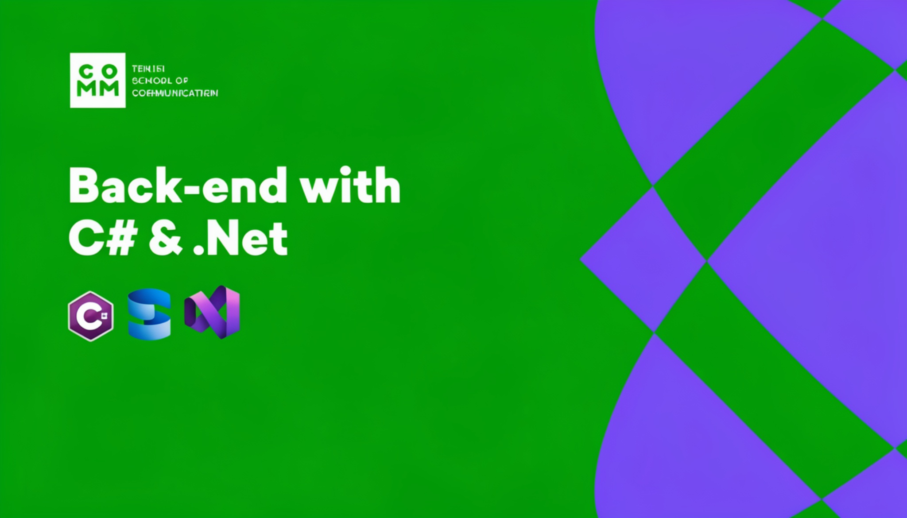

# WEB API



A RESTful Web API for managing people data, built with ASP.NET Core.

## Project Structure

```
├── public/                    # Static files (empty)
├── WebApplication/
│   ├── WebApplication.slnx   # Solution file
│   └── WebApplication/
│       ├── Controllers/
│       │   └── PersonController.cs    # REST API endpoints
│       ├── DTOs/
│       │   ├── PersonCreateDto.cs       # DTO for creating people
│       │   ├── PersonUpdateDto.cs       # DTO for updating people
│       │   ├── PersonDto.cs             # Main DTO for people
│       │   └── PersonAddressCreateDto.cs  # Address DTO
│       ├── Middleware/
│       │   └── ExceptionHandlingMiddleware.cs  # Global exception handling
│       ├── Models/
│       │   ├── Person.cs                # Person entity model
│       │   └── PersonAddress.cs         # Address model
│       ├── Properties/
│       │   └── launchSettings.json      # Launch configuration
│       ├── Responses/
│       │   └── ApiResponse.cs           # Standard API response wrapper
│       ├── Services/
│       │   ├── IPersonService.cs        # Service interface
│       │   └── PersonService.cs         # Service implementation
│       ├── Validators/
│       │   ├── PersonCreateDtoValidator.cs  # Validation rules for create
│       │   └── PersonUpdateDtoValidator.cs  # Validation rules for update
│       ├── appsettings.json             # Application configuration
│       ├── appsettings.Development.json   # Development configuration
│       ├── people.json                    # Sample data file
│       ├── Program.cs                     # Application entry point
│       └── WebApplication.csproj          # Project file
├── .gitignore
└── README.md
```

## Features

- **RESTful API** for CRUD operations on people
- **API Versioning** (v1) with multiple version readers (URL segment, query string, header)
- **Swagger/OpenAPI** documentation available at `/swagger`
- **Response Caching** for improved performance
- **Health Checks** endpoint at `/health`
- **CORS** support enabled
- **Fluent Validation** for request validation
- **AutoMapper** for object-to-object mapping
- **Global Exception Handling** middleware

## API Endpoints

| Method | Endpoint | Description |
|--------|----------|-------------|
| POST | `/api/person` | Create a new person |
| GET | `/api/person` | Get all people (with optional filters) |
| GET | `/api/person/{id}` | Get person by ID |
| PUT | `/api/person/{id}` | Update person by ID |
| DELETE | `/api/person/{id}` | Delete person by ID |

### Query Parameters (for GET all)

- `minSalary` - Filter by minimum salary
- `maxSalary` - Filter by maximum salary
- `city` - Filter by city

## Technologies

- **Framework**: ASP.NET Core (.NET 10.0)
- **API Versioning**: Microsoft.AspNetCore.Mvc.Versioning
- **Documentation**: Swashbuckle.AspNetCore (Swagger)
- **Validation**: FluentValidation
- **Mapping**: AutoMapper

## Getting Started

### Prerequisites

- .NET 10.0 SDK
- Visual Studio or VS Code with C# extension

### Running the Application

```bash
git clone https://github.com/GiorgiKavtaradze-prog/assignments.git
cd WebApplication/WebApplication
dotnet run
```

The API will be available at `https://localhost:5001` (or the configured port).

### API Documentation

Once running, navigate to `https://localhost:5001/swagger` to access the Swagger UI.

## Configuration

The application uses `appsettings.json` for configuration. Key settings include:

- **Kestrel** server configuration
- **Logging** levels
- **Allowed hosts**

## Response Format

All API responses follow a standard format:

```json
{
  "success": true,
  "data": { ... },
  "message": "Operation completed successfully",
  "errors": []
}
```

## License

This project is part of an assignment.
